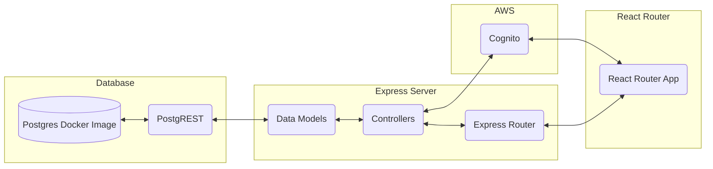

# Full-Stack Application Assessment

This repo contains a full-stack web app built with the following technologies:

* **React Router V7 (Framework Mode)** - Uses client side routing and LOADERS and ACTIONS for data fetching and mutations. Framework mode comes with vite installed for bundling and transpiling.
* **Mantine** - A front end component library which uses postcss for styling.
* **Docker** - Used to containerize both the react application and the postgres database for deployment.
* **PostgreSQL** - A containerized database with schema and seeding. Note: The current postgres scripts do not save a volume locally.
* **PostgREST** - API layer for PostgreSQL.
* **AWS Cognito** - Authentication service.
* **AG Grid** - Data grid component.

## System Architecture

This fullstack application is designed to follow a MVC architecture, where the views are handled by React Router, and the express server is used to handle the business and data logic (Models and Controllers). This structure allows for a separation of concerns and a more modular design.

At this point the functions of the controllers and models are somewhat abitrary, but they are easily extendable and can be used to handle more complex business logic.

The below diagram shows the relationship between the different components of the system. In production, 4 docker containers are used: 1 for the postgres database, 1 for the postgrest api, 1 for the express server, and 1 for the react application.



## Development

To run the application in development mode, run the following command:

*This is missing the docker compose file for the postgres database and postgrest api.*
```bash
npm install
npm run dev
```

This will start the react application in development mode and the express server in development mode.

## Deployment

To deploy the application on a virtual machine:

1. SSH into VM
2. Run
```bash
sudo apt update
sudo apt upgrade
```
3. Install node (Recommend using NVM)
4. Clone the repository - your VM should have git installed but you may need to install this
5. Configure the environment variables in the root .env file and the frontend .env file
* Each app (i.e. frontend, server, database have their own env file and env.example file. However, in production all apps are run via docker compose, this has been setup so that only the root .env file and the frontend .env file are required - this should all be moved into one env file in the future) 
6. Run the start script
```bash
npm run start:docker
```


## Callouts

* Currently there is no testing
* Key features such as forgot pw are not implemented as they are out of scope.
* Whilst the express server is not specifically required as all server logic could be handled in react router server actions, it is useful for separating concerns and allows us to create API endpoints for external services without impacting our frontend server (This would be useful if we needed to frequently connect to a platform like SAP).

