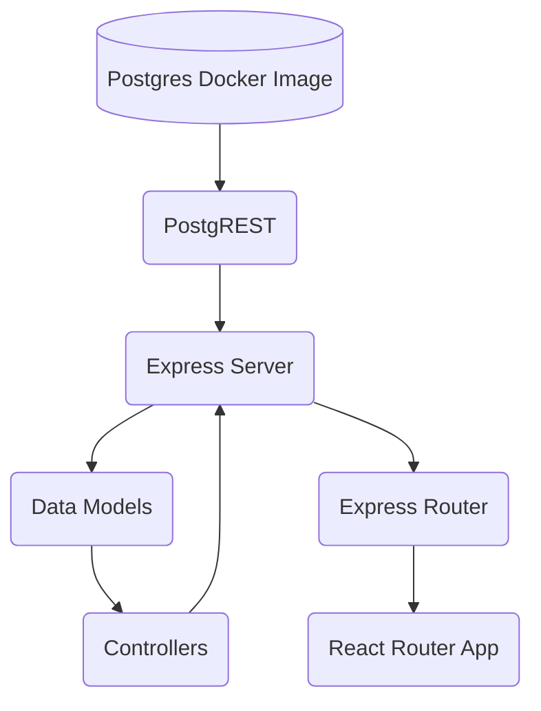

# Full-Stack Application Assessment

This repo contains a full-stack web app built with the following technologies:

## React Router V7 (Framework Mode)

[React Router V7](https://reactrouter.com/home) uses client side routing and LOADERS and ACTIONS for data fetching and mutations. Framework mode comes with vite installed from bundling and transpiling.

## Mantine

[Mantine](https://mantine.dev/) is a front end component library which uses postcss for styling.

## Docker

[Docker](https://www.docker.com/) is used to containerize both the react application and the postgres database for deployment.

## PostgreSQL

A containerized [postgreSQL](https://www.postgresql.org/) database with a schema and seeding.
NOTE: The current postgres scripts do not save a volume locally. This means that if the container is deleted all data is lost. This should not be used in production.

## PostgREST

## AWS Cognito

## AG Grid

## System Architecture

This fullstack application is designed to follow a MVC architecture, where the views are handled by React Router, and the express server is used to handle the business and data logic (Models and Controllers). This structure allows for a separation of concerns and a more modular design.

At this point the functions of the controllers and models are somewhat abitrary, but they are easily extendable and can be used to handle more complex business logic.

